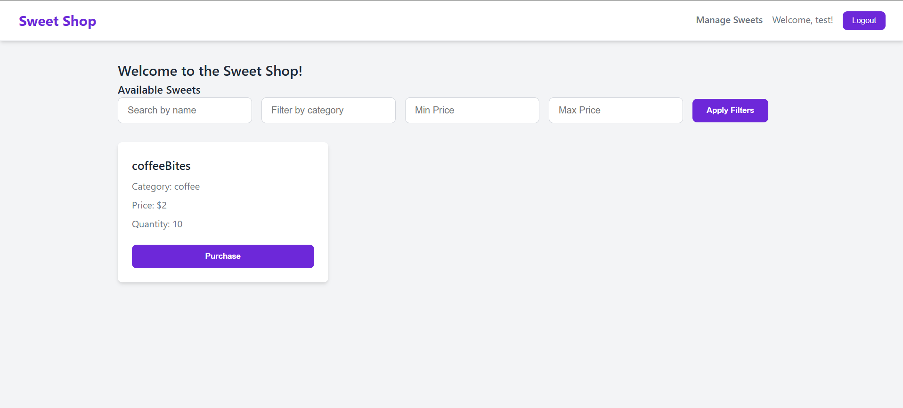
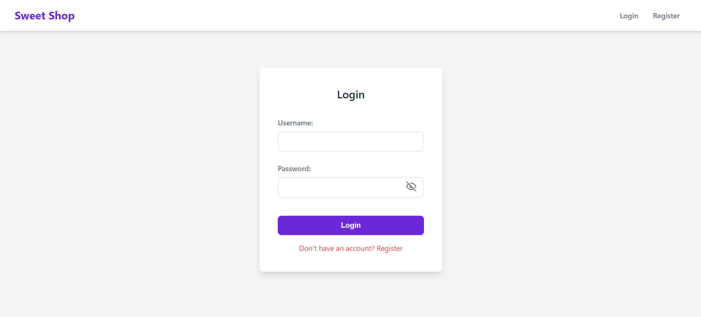
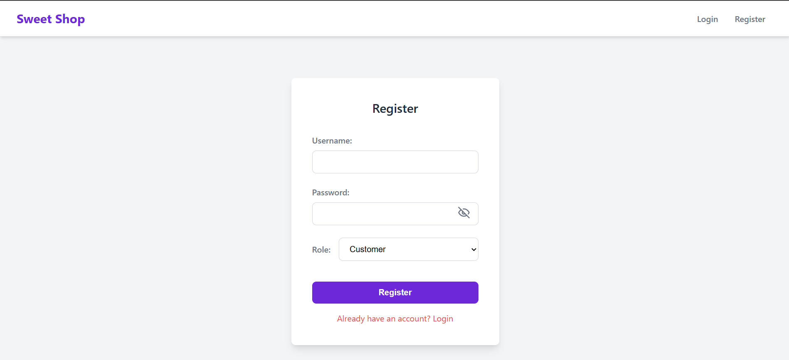
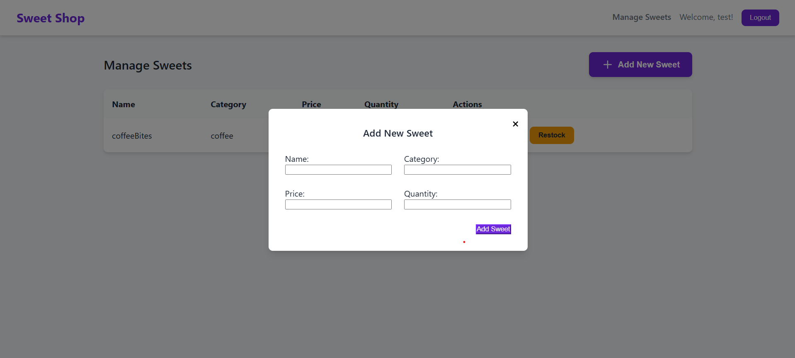

# Sweet Shop Management System

This is a full-stack web application for managing a sweet shop. It includes features for user authentication, browsing sweets, purchasing items, and admin-only functionalities for managing the inventory.

## Features

- User registration and login with JWT authentication, including role selection (customer/admin) during registration.
- Enhanced UI/UX for a more professional and intuitive experience.
- Browse and search for sweets by name, category, and price.
- Purchase sweets (quantity decreases).
- Admin panel to add, update, and delete sweets using interactive modals.
- Admins can restock sweets via a dedicated modal.
- Dismissible success and error messages for clear user feedback.
- Password visibility toggle on login and registration forms.

## Technologies Used

- **Frontend:** React, React Router
- **Backend:** Node.js, Express, MongoDB, Mongoose
- **Authentication:** JSON Web Tokens (JWT)

## Setup and Installation

### Prerequisites

- Node.js and npm
- MongoDB

### Environment Variables

Before running the application, you need to set up environment variables for both the backend and frontend. These variables should be configured in your hosting environment (e.g., Render, Vercel) when deploying.

#### Backend (`backend/.env`)

Create a `.env` file in the `backend` directory with the following content:

```
MONGO_URL=your_mongodb_connection_string
JWT_SECRET=your_jwt_secret_key
CORS_ORIGIN=http://localhost:3000 # Or your frontend's deployed URL (e.g., https://your-frontend-app.vercel.app)
```

*   `MONGO_URL`: Your MongoDB connection string. Replace `your_mongodb_connection_string` with your actual MongoDB URI.
*   `JWT_SECRET`: A strong, random string used to sign and verify JWTs. Keep this secret.
*   `CORS_ORIGIN`: The origin (URL) of your frontend application. This is crucial for Cross-Origin Resource Sharing (CORS) to allow your frontend to communicate with your backend. In development, it's typically `http://localhost:3000`. In production, it should be the exact URL where your frontend is hosted.

#### Frontend (`frontend/.env`)

Create a `.env` file in the `frontend` directory with the following content:

```
REACT_APP_API_URL=http://localhost:5000 # Or your backend's deployed URL (e.g., https://your-backend-api.onrender.com)
```

*   `REACT_APP_API_URL`: The base URL of your backend API. In development, it's typically `http://localhost:5000`. In production, it should be the exact URL where your backend API is hosted.

### Running Locally

#### Backend

1.  Navigate to the `backend` directory:
    ```sh
    cd backend
    ```
2.  Install the dependencies:
    ```sh
    npm install
    ```
3.  Start the backend server:
    ```sh
    npm start
    ```

#### Frontend

1.  Navigate to the `frontend` directory:
    ```sh
    cd frontend
    ```
2.  Install the dependencies:
    ```sh
    npm install
    ```
3.  **Important:** Remove the `"proxy"` line from `frontend/package.json` if it exists. This is a development-only setting.
4.  Start the frontend development server:
    ```sh
    npm start
    ```

The application will be available at `http://localhost:3000`.

### Building for Production

To create a production build of the frontend:

```sh
cd frontend
npm run build
```

This will create a `build` folder with optimized static assets.

## Testing

Basic unit tests have been added for both the frontend and backend.

### Running Backend Tests

```sh
cd backend
npm test
```

### Running Frontend Tests

```sh
cd frontend
npm test
```

## Screenshots






## My AI Usage

I have used an AI assistant (Gemini) to help with the following tasks:

-   **UI/UX Improvement:** The AI analyzed existing CSS and suggested a more modern design, including color palettes, typography, and layout adjustments. It also assisted in refactoring components to use modals and dismissible messages for a better user experience.
-   **Code Generation & Refactoring:** The AI generated boilerplate code for new components (e.g., `Modal.js`) and assisted in refactoring existing components (`AdminSweets.js`, `SweetForm.js`, `App.js`, `SweetList.js`) to integrate new features and improve code structure.
-   **Error Handling:** The AI helped in implementing more specific error message displays on the frontend by guiding the modification of state management and rendering logic.
-   **Debugging:** The AI assisted in identifying and resolving syntax errors and logical issues during development, such as the `SyntaxError` in `backend/routes/sweets.js` and the missing password label.
-   **Deployment Preparation:** The AI guided the process of preparing the application for hosting, including configuring environment variables, removing development-specific `console.log` statements, and setting up CORS.

Overall, the AI assistant was an invaluable tool throughout this project, significantly accelerating development by providing solutions, suggesting improvements, and helping to debug issues. Its ability to quickly analyze code and propose changes was particularly helpful in iterating on the UI/UX and ensuring a robust application.